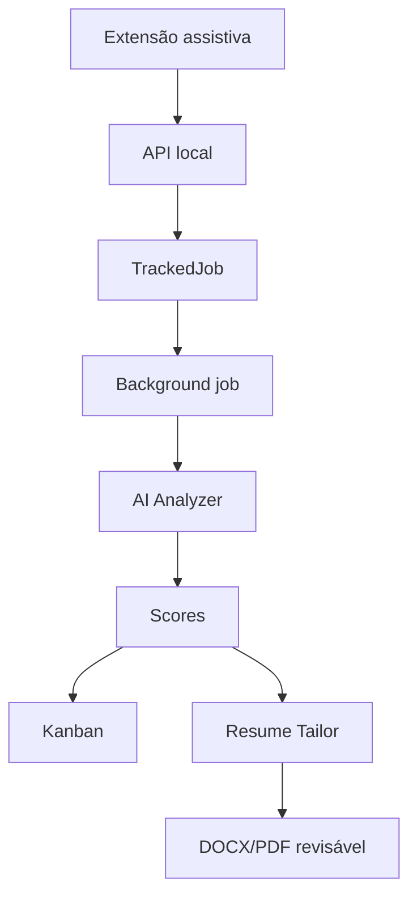

# Benchmark: LA_Jobs_AI_CLAUDE

O projeto `LA_Jobs_AI_CLAUDE` é uma referência prática porque implementa uma arquitetura parecida com partes futuras do SotuHire:

- backend Laravel;
- frontend Angular;
- extensão Chrome;
- tracker de vagas;
- IA para análise;
- geração de currículo;
- dashboard;
- fila de processamento.

## O que aproveitar

1. Extensão assistiva.
2. Modelo `TrackedJob`.
3. Processamento em background.
4. Dashboard de métricas.
5. Geração de currículo ATS.
6. Histórico de currículos gerados.

## O que evitar

1. README genérico de framework.
2. JSON extraído por regex.
3. Regras de negócio escondidas em prompt gigante.
4. Dados locais versionados no Git.
5. Captura ambígua do clique em Apply.

## Como o SotuHire deve melhorar

O SotuHire deve usar:

- Pydantic;
- JSON Schema;
- providers isolados;
- regras testáveis;
- botão próprio na extensão;
- tracker com status claro;
- guardrails de compliance;
- documentação forte.

## Fluxo conceitual

## Nota sobre provedores

Apesar do nome sugerir Claude, o ZIP analisado usava Groq no backend. Por isso, a referência deve ser documentada como arquitetura, não como dependência específica de Claude.
