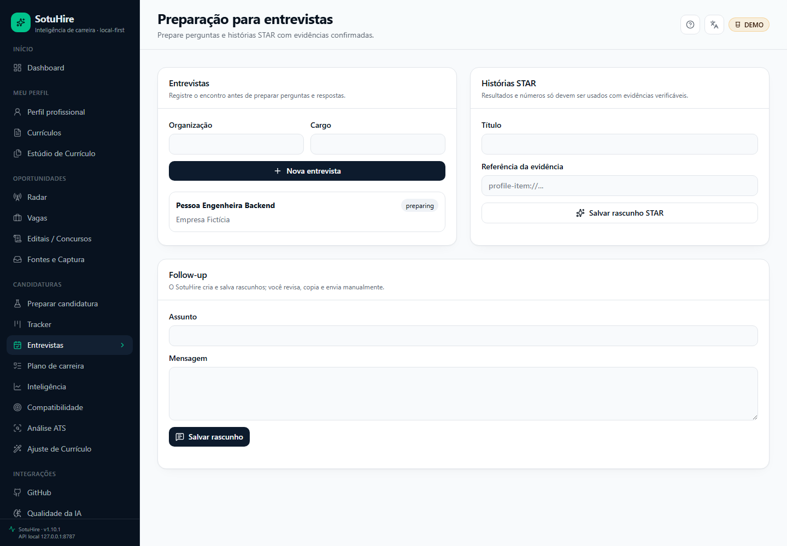
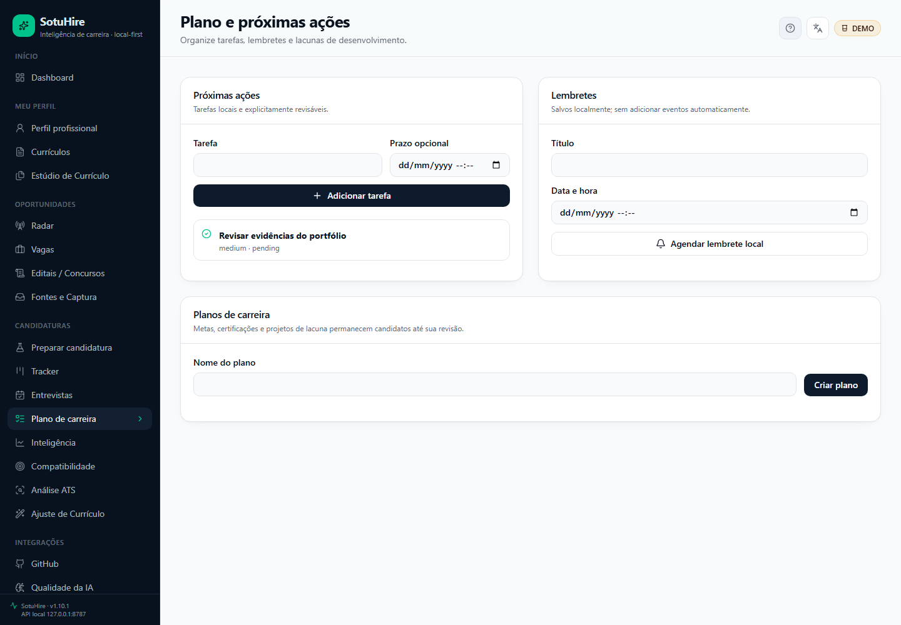
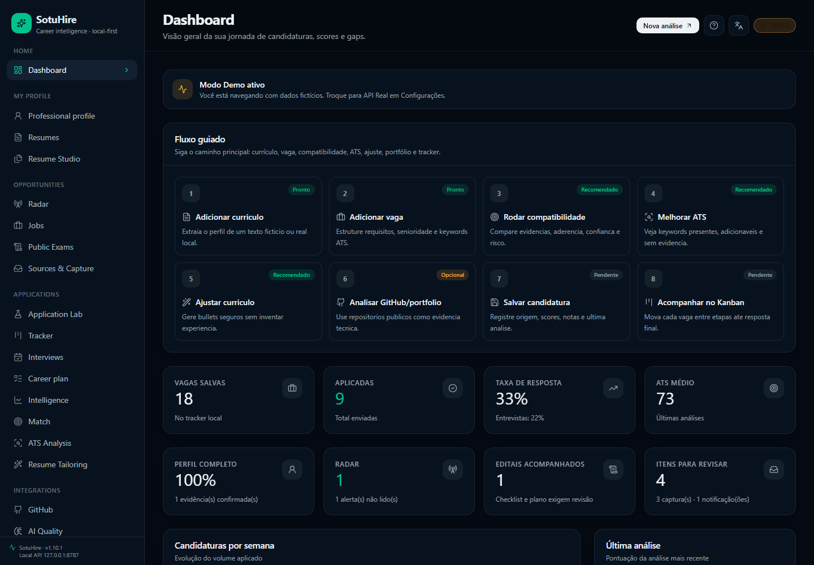
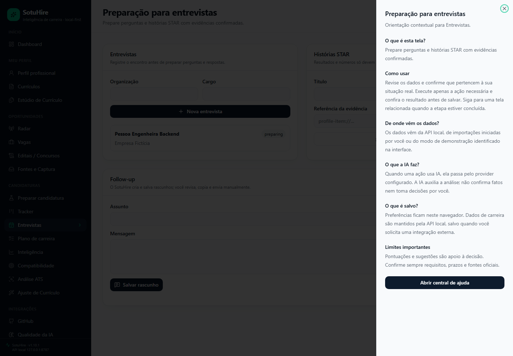
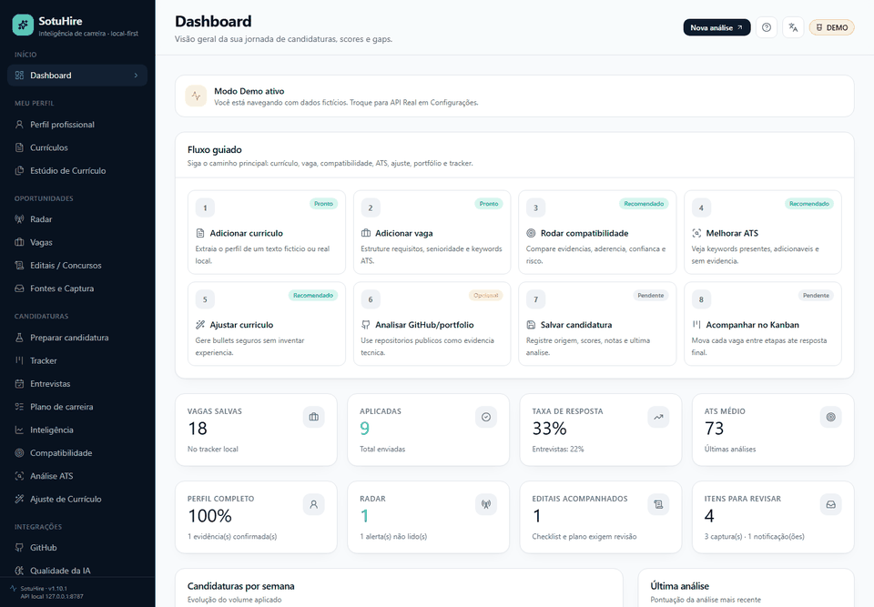

# SotuHire v1.10.1 — Career Intelligence, Official Sources, Interview & Action Workflows

Release estável local-first que conecta fontes públicas, taxonomias, oportunidade, candidatura, entrevista e ações de carreira em um fluxo revisável.

## Destaques

- Greenhouse, Lever, schema.org JobPosting e RSS/Atom com proveniência;
- CBO/QBQ/ESCO/O*NET versionados, sem inferir regulação;
- dedupe e ranking local com fit, confiança e cobertura separados;
- Interview Preparation, banco STAR, perguntas/respostas e follow-up draft;
- tarefas, lembretes, Career Plan, certificações, projetos de gap e ICS explícito;
- provider tasks padronizadas com opt-in e fallback;
- tema claro/escuro/sistema, locale adaptativo, ajuda e onboarding;
- extensão 0.10.0;
- schema SQLite 7;
- hardening de pairing, SSRF, JSON Resume e redaction `AQ.`.

## Galeria

| Interview, STAR e follow-up | Ações e plano de carreira |
|---|---|
|  |  |

| Tema escuro e shell em inglês | Ajuda contextual |
|---|---|
|  |  |

## Migração

Instalações schema 6 sobem para 7 de forma idempotente com backup. Stores JSON legados não são convertidos implicitamente. Consulte [a migração](../07-development/v1.10.1-migration.md).

## Segurança e limites

Não há auto-apply, envio de follow-up, preenchimento de formulário, login/captcha/cookies, adição automática de calendário, pagamento ou fatos inventados. Downloads ICS e cópias exigem ação humana.

## Artefatos

- `sotuhire-extension-v0.10.0.zip`;
- `SHA256SUMS`;
- SBOM CycloneDX.

Os hashes e resultados do CI são preenchidos pelos artefatos publicados e pela execução remota associada à tag.
