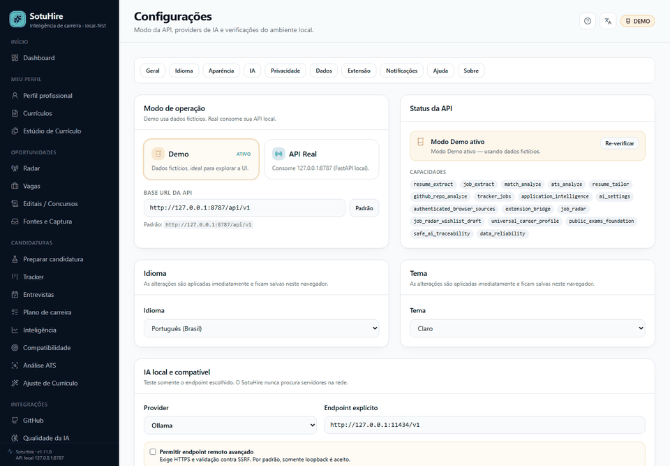
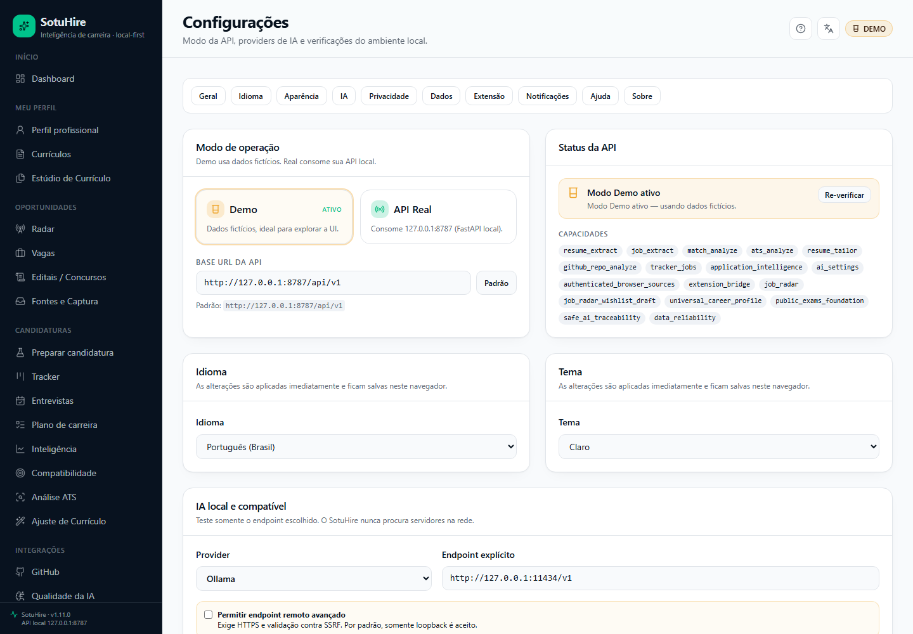
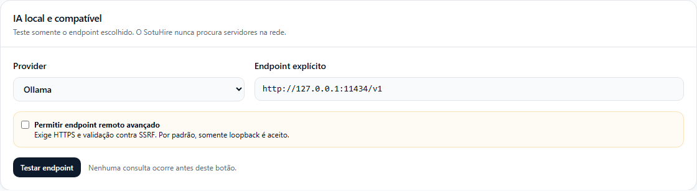
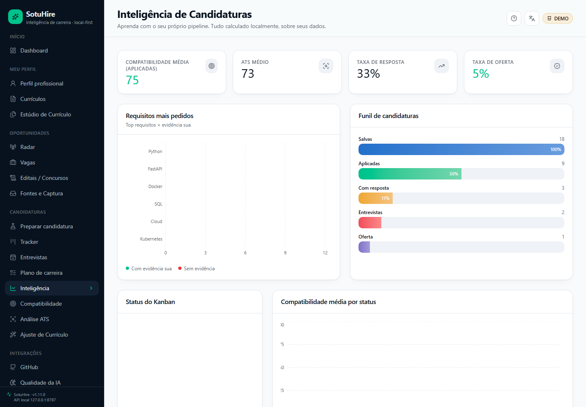
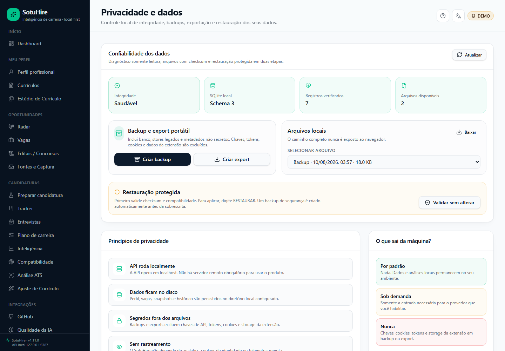

# SotuHire v1.11.0 — Security, Career Intelligence & Local AI

Esta release fortalece boundaries de rede/path/URL, atualiza dependências e Actions, adiciona
matching determinístico por domínio, analytics explicável, taxonomy updater explícito e
interoperabilidade com Ollama, LM Studio e endpoints OpenAI-compatible.

## Destaques

- conexão SSRF-safe ao mesmo IP público validado, inclusive após redirect;
- safe paths para backup, restore, taxonomy e JSON recovery;
- CodeQL v4 e Actions Node 24 pinadas por SHA;
- npm sem critical/high e nanoid 3.3.18;
- pipeline PDF BSD com pypdf/ReportLab no lugar de PyMuPDF;
- 13 DomainMatchingPolicies e testes contrafactuais;
- analytics com `n`, período, denominador e aviso de amostra;
- preview/apply/status/rollback para CBO, QBQ, ESCO e O*NET;
- health check local somente por ação explícita e sem network scan;
- 25/25 AiTasks mapeadas a prompt, schema, purpose, evidence scope e consumer.

## Compatibilidade

- aplicação e Companion: 1.11.0;
- extensão: 0.10.0, sem bump vazio porque seu runtime não mudou;
- SQLite: schema 7, sem migração artificial;
- origem suportada: v1.10.1 no commit `22ace5e7cf7dab7bb81d624a5b90d0e2830d16c6`.

## Preview fictício

| Settings consolidado | IA local explícita |
| --- | --- |
|  |  |

| Analytics | Status de segurança |
| --- | --- |
|  |  |

## Segurança e privacidade

Os arquivos/endpoints authenticated-browser protegidos não foram alterados. Entradas são validadas
antes do launcher. Endpoints de IA remotos exigem opt-in avançado, HTTPS e proteção SSRF. Segredos
não são exibidos nem incluídos em traces, assets ou relatórios.

## Validação e assets

Backend aprovou 645 testes locais com cobertura 86%; frontend aprovou 18 unit, lint, typecheck,
build e npm audit. Os 67 cenários funcionais cross-browser ficaram verdes após a correção dirigida
da query key do Application Lab. Gemini aprovou 2/2 testes externos; OpenAI ficou explicitamente
bloqueada por quota. O smoke real não teve regressão configurada, mas preserva três erros Gemini e
um bloqueio OpenAI no relatório sanitizado. CI e CodeQL aprovaram o SHA de integração; a consulta
final retornou zero alertas CodeQL abertos.

Assets: extensão 0.10.0, SBOM CycloneDX 1.5 e `SHA256SUMS`, com verificação pós-download exigida.

## Limitações

- modelos locais continuam `unverified` até execução por modelo/endpoint;
- analytics é descritivo, sem causalidade;
- stores legados são migrados apenas por comando explícito e preservados para rollback;
- o banco pessoal local inspecionado permaneceu intacto no schema 6; a atualização ao schema 7
  exige execução explícita de `python scripts/migrate_local_data.py --apply`;
- conteúdo histórico de algumas telas ainda está em PT-BR; shell, metadata, ajuda, onboarding e
  preferências possuem catálogo pt-BR/en-US.
- Recharts 2.15.4 está sem manutenção; a migração para v3 é breaking e ficou fora do security batch.
