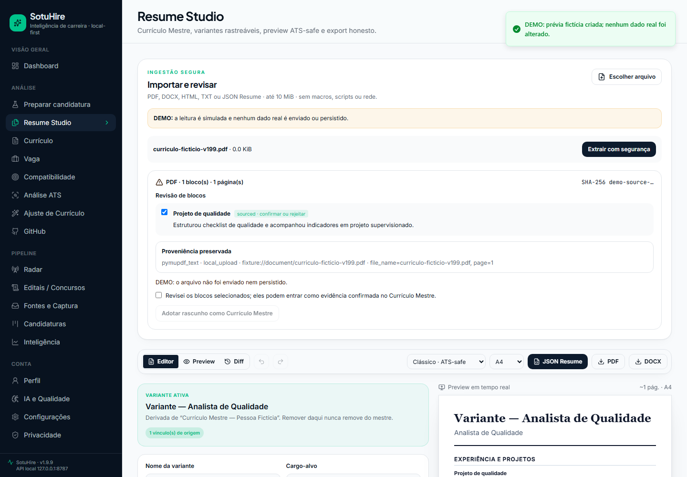
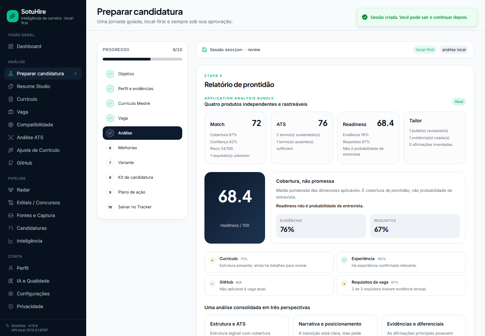
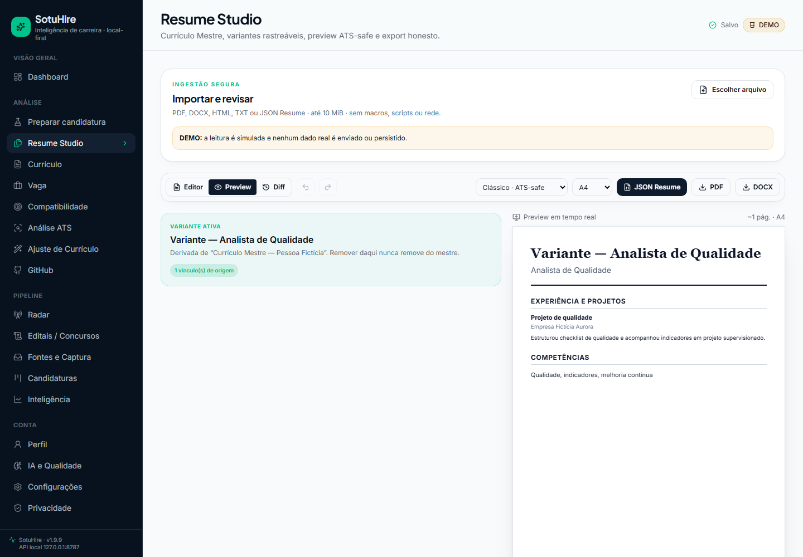
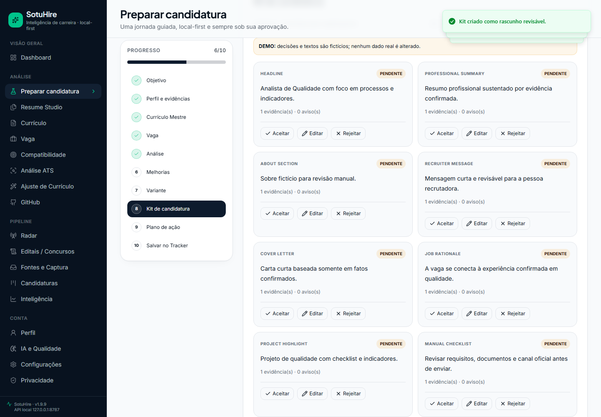
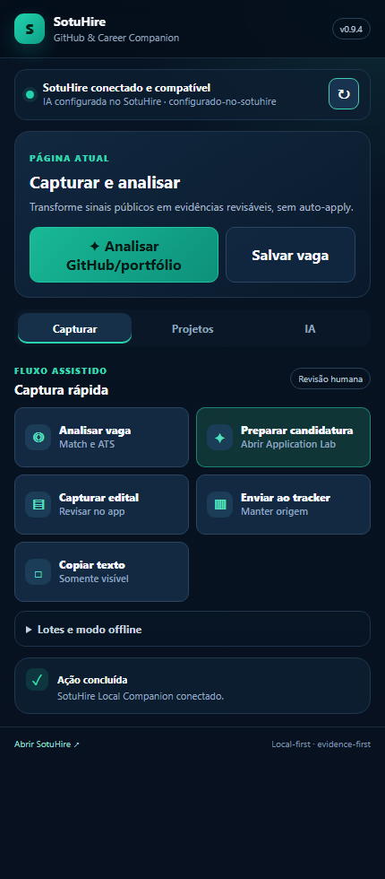
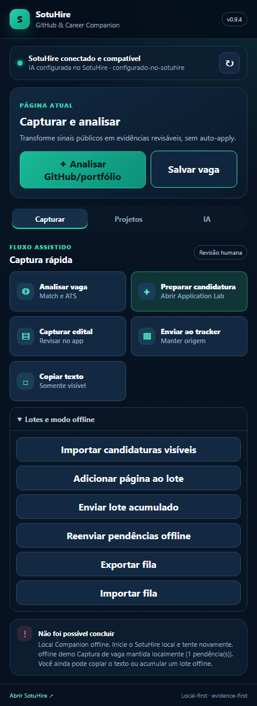

# SotuHire v1.9.9 — Security & Semantic Hardening, Document Ingestion, Professional Assets & Resume Studio Completion

Esta release incorpora diretamente o hardening antes planejado para uma versão intermediária e
fecha a jornada local de documento até candidatura, sem auto-apply e sem alterar o fluxo protegido
de navegador autenticado.

## Destaques

- localhost seguro por padrão: pairing, sessão HttpOnly/CSRF, token nativo, Host/Origin/CORS,
  rate limit e limites de payload;
- evidência com review/scope independentes e scores com semântica/denominadores explícitos;
- Application Lab com Match, ATS, readiness e Tailor reais e separados;
- ingestão local de PDF, DOCX, HTML, TXT e JSON Resume com proveniência e revisão;
- Currículo Mestre, variantes/diff e exports reais PDF, DOCX e JSON Resume;
- Professional Assets e Application Kit com lifecycle, revisão item a item e stale;
- Tracker/Lab transacionais, idempotência, JSON quarantine, perfil reconciliado e outcomes manuais;
- schema SQLite 6 e migration 5→6 com dry-run, backup, apply e verify explícitos;
- extensão MV3 0.9.5 com handoff seguro por IDs, fila/idempotência e estado connected/offline;
- SBOM CycloneDX, auditorias de dependência, scan amplo e capability manifest verificável.

## Privacidade e limites

Dados e documentos ficam locais por padrão. A extensão não lê currículos. Providers externos
recebem apenas contexto autorizado e não são necessários para o caminho local. Não há login,
form filling, candidatura/inscrição, pagamento, mensagem ou envio de documento automático.

PDF somente-imagem exige revisão manual porque OCR não é automático. A fidelidade dos exports é
semântica e ATS-safe, não pixel-perfect. Taxonomias/conectores oficiais ficam para a v1.10.0.

## Validação

Os resultados locais e remotos, contagens, audits, migration, clean install e status de providers
serão consolidados na
[auditoria final](../00-audit/v1.9.9-final-integration-audit.md) antes da criação da tag.
Suites externas sem as duas credenciais opt-in são registradas como **NOT EXECUTABLE**, nunca
como aprovadas. Mock, golden e release-smoke local permanecem obrigatórios.

## Assets

- `sotuhire-extension-v0.9.5.zip`;
- `SHA256SUMS.txt`;
- `sotuhire-sbom-v1.9.9.cdx.json`.

## Evidência visual

| Documento e proveniência | Análise independente |
|---|---|
|  |  |

| Resume Studio | Kit revisável |
|---|---|
|  |  |

| Extensão conectada | Extensão offline |
|---|---|
|  |  |

[Walkthrough documento → candidatura](../assets/screenshots/sotuhire-v1.9.9-document-to-application-walkthrough.gif)
